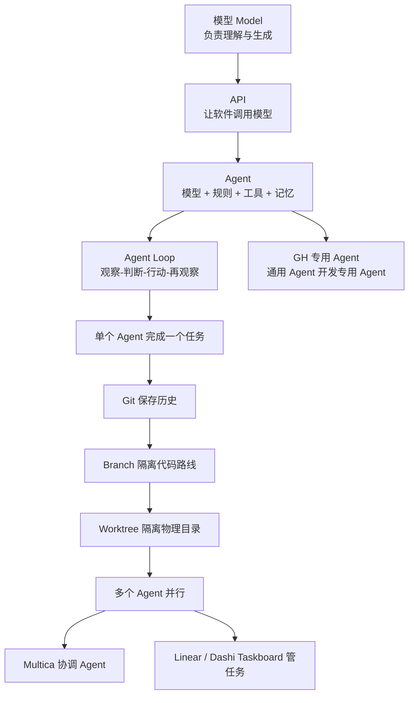

# Agent 学习路线：从“名词解释”对话开始

> [!summary] 一句话总览
> **模型负责生成与判断，API 负责连接，Agent Loop 负责循环推进，Tools 负责真实执行，Git 负责保存历史，Branch 负责隔离代码路线，Worktree 负责隔离工作目录，Multica 负责组织多个 Agent，Linear / Dashi Taskboard 负责组织任务。**

这套笔记把“名词解释”对话中，从“解释 Git、Worktree、Multica、Linear、Dashi Taskboard……”开始的全部内容，重新整理成适合 AI 新手的学习路线。原始问答也已按时间顺序归档，便于核对上下文。

## 推荐学习顺序

1. [[01-AI系统全景图-模型-API-Agent]]
2. [[02-Agent内部结构与Agent-Loop]]
3. [[03-本地模型-云端模型-API-Key与安全]]
4. [[04-Git-GitHub-Branch-Worktree与Workflow]]
5. [[05-Multica-Linear-Dashi-Taskboard与Harness]]
6. [[06-多Agent任务拆分与Token优化]]
7. [[07-GH-Data-Tree-Agent贯穿案例]]
8. [[08-术语速查与操作清单]]
9. [[09-常见误区与判断题]]

## 学习路线图

## 先建立 5 个最关键认知

### 1. 模型不等于 Agent

- **模型**像大脑：根据输入生成下一段文字、代码或工具调用意图。
- **Agent**像一个完整工作人员：除模型外，还有规则、工具、记忆、权限、任务状态和循环。
- 只调用一次模型并返回文字，通常只是“AI 功能”。
- 模型能根据结果继续调用工具、反复判断，才更接近 Agent。

### 2. 对话框、Agent、Workflow 不是同义词

- Codex 中的一个任务/对话，通常可理解为一个独立的工作上下文。
- 一个对话里可以包含多个步骤，也可以临时调用子 Agent。
- 新开对话不等于自动创建了一个标准化 Workflow。
- Workflow 是“按什么步骤完成某类工作”的流程，可以在一个对话中执行，也可跨多个 Agent。

### 3. Branch 与 Worktree 是两个层次

- Branch：Git 中的逻辑开发路线。
- Worktree：硬盘上的另一套实际工作目录。
- 常见并行开发组合：**一个任务 = 一个 Branch + 一个 Worktree + 一个 Agent 对话**。
- 但这不是硬性公式；简单任务不需要为每个小改动都创建一整套。

### 4. Multica 与 Harness 管的不是同一层

- Multica 更像多 Agent 工作平台：谁负责什么、多个工作者怎么并行。
- Harness 更像 Agent 的运行底座：一个 Agent 内部如何调用模型、工具、技能、记忆和权限。
- 它们可以处理相同业务目标，但抽象层次、实现方式和 Token 成本结构不同。

### 5. Token 成本不是只由 Agent 数量决定

Token 大致消耗在：重复传入的系统说明、历史、工具描述；Agent 之间重复交接背景；多个 Agent 重复读取同一材料；过长输出和无效反复；强模型处理了本可由规则或小模型完成的任务。

最省 Token 的方向不是“永远只用一个 Agent”，而是：**边界清楚、共享摘要、少重复、按难度分配模型、先用确定性工具。**

## 本次新增：Agent、Task、Run 与 Workflow 的精确关系

新增内容已整合进原有笔记，不另建主题文件：

- [[02-Agent内部结构与Agent-Loop]]：新增 `Context（一次工作经历）` 与 `Configuration（长期角色模板）` 的区别。
- [[04-Git-GitHub-Branch-Worktree与Workflow]]：新增“Branch 属于具体工作，不属于 Agent”，以及任务中途如何拆分 Core / UI。
- [[05-Multica-Linear-Dashi-Taskboard与Harness]]：新增 `Agent → Task → Run → Branch → Worktree → Workflow` 的完整层级。
- [[06-多Agent任务拆分与Token优化]]：新增 Core / UI 并行判断、接口契约和同一 Agent 配置多 Run 的策略。

> [!important] 新的核心结论
> **并行靠多个独立 Run，以及必要时配套的 Branch / Worktree；不要求创建多个不同 Agent 配置。只有职责、规则、Skills、模型或 Runtime 明显不同，才值得拆成不同 Agent。**

## 原始对话档案

- [[原始对话-01-Git到GitHub]]
- [[原始对话-02-Agent到多Agent]]
- [[原始对话-03-Harness到GH本地模型]]

> [!note] 关于图片
> 原对话中部分提问附带图片。任务记录只保留了“附有图片”的标记，没有包含图片像素内容；相关文字回答已完整归档，学习笔记则按回答中的语义补足了必要说明。

## 学习方法

每篇建议按四步阅读：先读“最短定义”；再看“工作逻辑”；对照 GH Data Tree Agent 案例；最后做文末自测。

不要一开始死记命令。先记住对象之间的关系，真正使用时再查 [[08-术语速查与操作清单]]。
