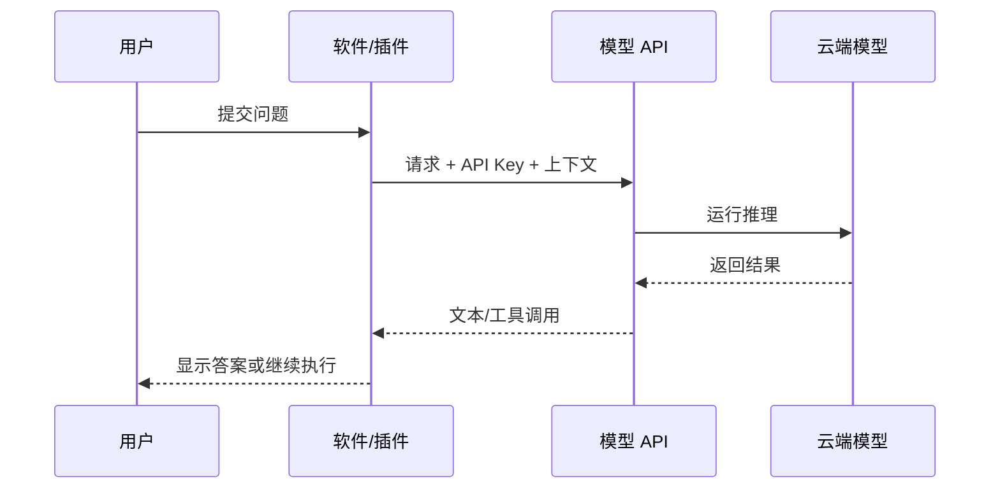

# AI 系统全景图：模型、API、插件与 Agent

## 一、最短定义

| 概念 | 像什么 | 核心职责 |
|---|---|---|
| Model / 大模型 | 大脑 | 根据上下文预测和生成下一步内容 |
| API | 服务窗口 / 插座 | 规定软件如何请求另一个服务 |
| API Key | 调用服务的钥匙和计费身份 | 证明调用者身份、关联额度与账单 |
| Plugin / 插件 | 装在宿主软件里的功能模块 | 把某种能力接入现有软件 |
| Tool / 工具 | Agent 的手脚 | 读取文件、运行程序、调用 GH API 等 |
| Skill / 技能 | 工作说明书 | 告诉 Agent 某类任务应遵循的知识和流程 |
| Agent | 工作人员 | 模型 + 规则 + 工具 + 记忆 + 循环 |
| Agent Runtime / Harness | 工作台和发动机 | 组装上下文、执行工具、保存状态、推进循环 |
| UI | 对话框 / 面板 | 人与 Agent 交互的界面 |

## 二、API 是什么

API 全称是 **Application Programming Interface，应用程序编程接口**。它是一套约定：可以发送什么请求、参数怎样写、服务返回什么、出错时怎样表示、如何认证和计费。



## 三、插件调用一次 AI API，算不算 Agent

**不一定。**

普通 AI 功能：

```text
用户输入 → 插件发给模型 API → 模型返回文字 → 插件显示 → 结束
```

更像真正的 Agent：

```text
用户目标 → 查看状态 → 模型决定下一步 → 调用工具 → 得到真实结果
→ 更新记忆 → 再次判断 → 直到完成或需要用户确认
```

判断标准是是否维护目标和状态、能否选择工具、是否依据结果继续行动、是否有权限边界、是否能多步推进。

## 四、Agent 在本地跑还是云端跑

答案经常是：**两边都跑。**

| 部分 | 常见位置 |
|---|---|
| 对话界面 | 本地应用 |
| 文件读取、编译、测试、Git | 用户电脑或远程开发机 |
| Agent Loop / Runtime | 本地、远程，或混合 |
| 大模型推理 | 云端 API，或用户本地模型 |
| 会话记录 | 本地、云端，或二者同步 |

要分别问：模型在哪里推理？工具在哪里执行？代码在哪里？记忆存在哪里？

## 五、Codex 对话框可以理解为一个 Agent 吗

作为新手近似理解：

> **一个 Codex 任务/对话框，是一个 Agent 的独立工作上下文。**

但它不等于固定角色、新 Workflow、新 Git Branch 或新 Worktree。

```text
Codex 任务/对话
├─ 独立上下文与目标
├─ 可能运行主要 Agent
├─ 可能调用临时子 Agent
├─ 可能连接项目目录
├─ 可能使用 Branch / Worktree
└─ 可能执行某套 Workflow
```

## 六、Workflow 是什么

Workflow 是“把某类任务从开始推进到完成的步骤”。

```text
读取问题 → 复现 → 定位原因 → 修改代码 → 运行测试 → 检查差异 → 提交审核
```

新开对话是新上下文；Workflow 是做事的方法和步骤。

## 七、GH Agent 的最小版本

最小 AI 功能：

```text
GH 插件 → 收集 Data Tree 摘要 → 调用模型 API → 返回解释
```

真正的 GH Agent：

```text
定位 Tree 异常 → inspect_gh_document → inspect_data_tree
→ 判断空 Branch / Null / Path 异常 → 追踪上游 → 验证
→ 给出修复建议 → 用户批准后修改
```

## 八、自测

- [ ] 我能解释 Model 与 Agent 的差别。
- [ ] 我知道 API 是调用协议，不是模型本身。
- [ ] 我知道 Plugin 调用 API 不一定构成 Agent。
- [ ] 我能分别回答“模型、工具、文件、记忆在哪里”。
- [ ] 我不会把“新对话”直接等同于“新 Workflow”。
