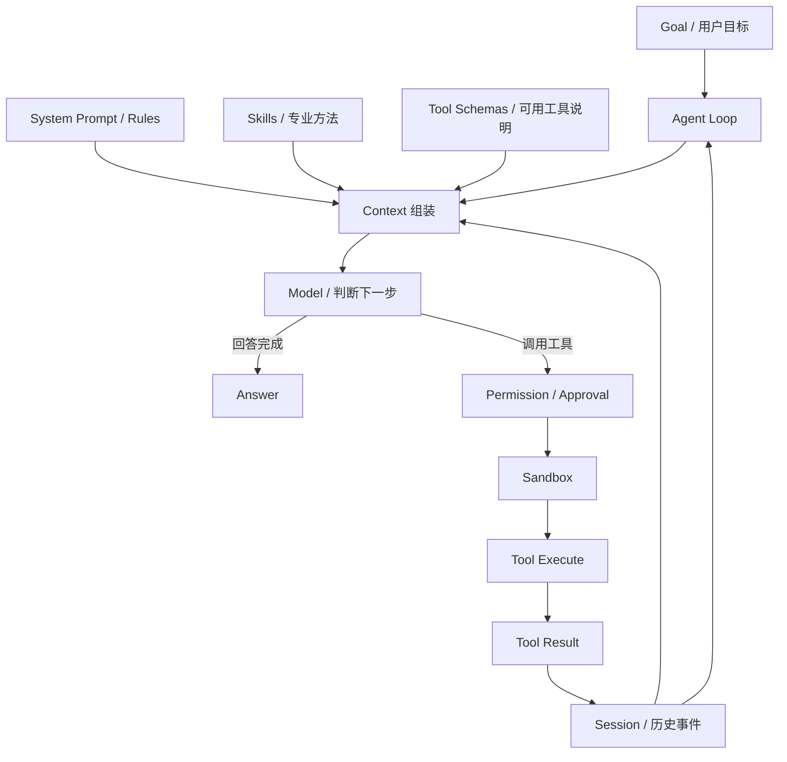

# Agent 内部结构与 Agent Loop

> [!important] 最应该记住的一句话
> **观察当前状态 → 组装上下文 → 模型判断 → 调用工具 → 得到结果 → 写入会话 → 再判断，直到目标完成。**

## 一、Agent 的组成



### Model：大脑

输入包括身份与规则、目标、历史、文件摘要和工具说明；输出可能是回答、工具调用、澄清问题或完成状态。模型本身通常不直接操作电脑。

### System Prompt / Rules：身份与边界

决定你是谁、优先级、什么能做、何时询问用户和输出格式。

### Skills：专业方法

Skill 是可复用的工作说明书。例如 Data Tree 调试：统计 Branch、检查 Path、找 Empty Branch、找 Null、比较数据长度、判断 Graft/Flatten/Simplify、追踪上游。

### Tools：手和脚

通用工具有读写文件、搜索代码、测试、Git；GH 专用工具有 `inspect_gh_document()`、`inspect_component(id)`、`inspect_data_tree(id)`、`trace_upstream(id)`。

### Session：发生过什么

```text
turn/start
user/message
tool/call
tool/result
approval/request
approval/result
assistant/message
turn/end
```

### Storage / Persistence：经历存在哪里

Session 是逻辑记录；Storage 是 JSONL、SQLite 或云数据库等物理保存方式。

### Sandbox：活动边界

限制 Agent 可读取或写入的目录、网络、命令、密钥和系统资源。工具决定“会什么”，Sandbox 决定“能碰什么”。

### Permission / Approval：何时询问人

读取和搜索通常可自动允许；删除、上传私密数据、外部发布、产生费用等需要明确批准。

### Goals / Plan：持续任务状态

记录已完成、正在做、未开始、阻塞原因和验收标准。

### Subagent：临时同事

主 Agent 可委派边界清楚的研究、测试或审查任务。价值是并行与专门化，代价是上下文复制和交接。

### Scheduling / Jobs：后台任务

编译、测试、索引等耗时动作可后台运行，完成后结果写回 Session。

### UI：你看到的界面

聊天窗口、CLI、IDE、GH Panel 只是 UI，不是 Agent 本体。

## 二、Turn、Step 与 Loop

- **Turn**：用户一次目标到 Agent 本次回应结束。
- **Step**：一次模型判断，以及它触发的工具活动。
- **Agent Loop**：一个 Turn 内不断产生 Step，直到完成。

```text
Turn：检查 Tree 为什么异常

Step 1 → inspect_gh_document → 53 个组件、3 个警告
Step 2 → inspect_data_tree → {0;2} 为空
Step 3 → trace_upstream → 上游列表长度不一致
Step 4 → 形成根因和修复建议
```

## 三、普通聊天与 Agent

| 普通聊天 | Agent |
|---|---|
| 一次输入，一次输出 | 多步循环 |
| 依赖用户提供事实 | 能主动读取环境 |
| 不一定有工具 | 有受控工具 |
| 通常生成建议 | 可验证和执行 |
| 历史多为对话文本 | 含工具事件与任务状态 |
| 完成标准模糊 | 可有明确验收条件 |

## 四、Agent 的能力组合

```text
Model：会不会想
Harness：能不能稳定地行动
Skills：懂不懂专业方法
```

强模型 + 无工具：聪明但碰不到真实环境。  
强模型 + 工具 + Loop：通用 Coding Agent。  
强模型 + Harness + GH Skills + GH Tools：GH 专用 Agent。

## 五、Context 与 Configuration：最容易混淆的新概念

Codex 对话和 Multica Agent 都能记住“角色要求”，所以使用体验会重叠；真正差异在于这些信息主要服务于一次工作，还是被抽成长期模板。

### Context：这次工作发生了什么

```text
用户目标
+ 本轮追问
+ 已读文件
+ 工具调用与结果
+ 临时约束
+ 当前任务的决定
```

Context 属于某个 Task / Session。它回答：

> **“这件事从开始到现在发生了什么？”**

例如一个 Codex 对话中，用户先要求修复 Empty Tree Crash，随后补充“不要改 UI”，Agent 又得到 Build 失败结果；这些都是这一次工作的 Context。

### Configuration：以后做这类工作时，它是什么样的 Agent

```text
Role: GH Debug Engineer
Model: 强推理模型
Thinking: High
Skills: Grasshopper / RhinoCommon / Debugging
Rules: 先复现、最小修改、修复后测试
Runtime: Windows GH Dev Machine
```

Configuration 回答：

> **“无论分配哪个 Bug，这个 AI 工作者应采用什么长期身份和能力配置？”**

### Codex 与 Multica 的边界不是绝对的

Codex 也能通过项目 Instructions、Skills、规则和环境配置跨任务复用能力。因此不能说“Codex 只有临时 Prompt，Multica 才能配置 Agent”。

更准确地说：

- **Codex 对话首先是一次独立工作上下文**，也可以扮演一个 Agent 角色。
- **Multica Agent 首先是可复用、可管理、可批量调度的角色模板**。
- 项目规模小时，几个 Codex 任务加清晰的项目规则通常已经够用。
- 当角色、模型、Skills、Runtime、并发和任务状态需要反复统一管理时，Multica 的价值才明显。

## 六、Task、Session 与 Run

| 对象 | 回答的问题 | 是否长期复用 |
|---|---|---|
| Agent Configuration | 谁来做、具备什么能力 | 通常可以 |
| Task | 要完成什么具体工作 | 通常不复用 |
| Session / 对话 | 这次工作积累了什么上下文 | 属于这次工作 |
| Run | 任务的一次实际执行 | 每次执行独立 |
| Workflow | 从创建任务到测试、审查、合并的完整过程 | 流程模板可复用 |

同一个 Agent Configuration 可以服务多个 Task；同一个 Task 也可能因为重试、并行方案或恢复而产生多个 Run。


## 七、自测

- [ ] 我能完整复述 Agent Loop。
- [ ] 我知道 Tool 与 Skill 的差别。
- [ ] 我知道 Session 与 Storage 的差别。
- [ ] 我知道 Sandbox 与 Permission 不同。
- [ ] 我能解释为什么 UI 不是 Agent 本体。
