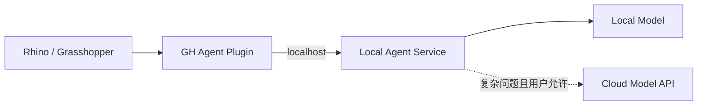

# 本地模型、云端模型、API Key 与安全

## 一、本地模型与云端模型

### 云端模型

```text
你的软件 → 互联网 → 模型厂商 API → 云端 GPU 推理 → 返回结果
```

优点：通常能力更强；无需管理显卡；供应商负责升级；上手快。  
缺点：按 Token 或套餐计费；依赖网络；数据离开本机；受额度、速率和服务可用性影响。

### 本地模型

```text
你的软件 → localhost / 本机进程 → Ollama / llama.cpp / 自建 Runtime
→ 本机模型权重 → 返回结果
```

优点：可离线；数据可留在本机；通常没有云端按 Token 计费；可自由选择模型。  
缺点：占硬盘、内存、显存和算力；安装升级复杂；能力和速度受硬件限制；需关注模型许可证。

> [!important]
> 本地模型仍然处理 Token。区别是成本从“云 API 账单”变为“本机硬件、耗电、等待时间、下载体积和维护成本”。

## 二、模型、Runtime 与插件

- **Local Model**：权重文件存在哪里。
- **Local Model Runtime / Agent Service**：谁加载权重并提供推理接口。
- **GH Plugin**：怎样取得 GH 数据并与 Runtime 通信。



模型和 Runtime 都可以在用户电脑上，但不必塞进 `.gha` 文件或 Rhino 进程。

## 三、为什么 Runtime 最好独立

把模型放进 Rhino 进程会带来内存、显存、崩溃、更新、驱动兼容和巨大安装包问题。

独立服务可以单独重启，插件保持轻量，方便替换模型、适配 GPU/CPU、增加云端 fallback，并让 Rhino 专注 UI 与 GH API。

## 四、适合 GH Agent 的混合架构

```text
确定性规则 / C# Analyzer
→ 能解决：直接返回
→ 不能解决：本地小模型
→ 仍不能解决：经用户允许调用云端强模型
```

| 问题 | 优先处理层 |
|---|---|
| Empty Branch、Null Item | C# 规则 |
| 简单 Path 异常 | 规则 / 本地小模型 |
| 常见 Graft/Flatten 误用 | 规则 + 本地模型 |
| 跨大量组件的复杂根因 | 云端强模型或高级 Agent |
| 高隐私项目 | 本地模式 |

## 五、API Key 是什么

API Key 是调用凭证，用于识别调用者、检查权限、记录额度、计算费用和限制滥用。它类似“门禁卡 + 计费身份”，但通常不是登录密码。

供应商验证请求中的 Key 后允许调用。Key 只证明有权使用额度，并不会自动把第三方软件变成 Agent。

## 六、第三方软件会不会泄露 Key

**有可能。关键取决于 Key 存在哪里、发送到哪里、日志是否记录。**

高风险做法：

- 写进前端 JavaScript；
- 提交 Git / GitHub；
- 放进公开配置；
- 打印到日志、截图或聊天；
- 交给不可信插件；
- 打包进发布给用户的插件。

安全做法：

- 使用环境变量或安全凭证；
- 后端代理持有 Key；
- 每个应用使用不同 Key；
- 设置费用和速率上限；
- 定期轮换；
- 发现泄露立即撤销；
- 日志脱敏；
- 最小权限。

## 七、GH 商业产品的三种策略

1. **用户自带 Key**：账单归用户，但配置和支持复杂。
2. **你的服务器代理**：体验统一，但你承担费用、安全和运维。
3. **本地优先 + 云端可选**：适合建筑与工程隐私场景。

## 八、自测

- [ ] 我知道本地模型也使用 Token。
- [ ] 我能区分模型权重、Runtime 和 GH 插件。
- [ ] 我知道 API Key 不应写入前端或提交 Git。
- [ ] 我能解释独立 Agent Service 的好处。
- [ ] 我能说出混合架构的升级顺序。
