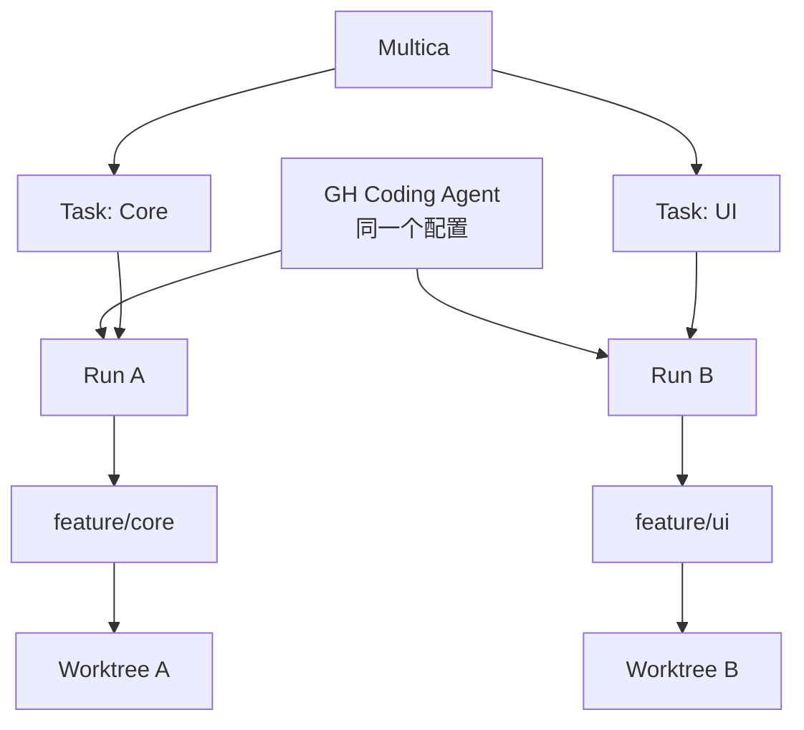

# Multica、Linear、Dashi Taskboard 与 Harness

## 一、它们分别在哪一层

| 工具/概念 | 主要问题 | 类比 |
|---|---|---|
| Multica | 多个 Agent 如何分工、并行、协调 | Agent 团队平台 |
| Linear | Issue、项目、周期、状态 | 专业项目管理 |
| Dashi Taskboard | 轻量任务看板与 Agent 连接 | Agent 任务白板 |
| Harness | 一个 Agent 内部如何运行 | 发动机与底盘 |
| Codex | 通用 Agent 工作环境 | 工作人员 |
| Git/Worktree | 代码和目录隔离 | 档案与工作房间 |

## 二、Multica 是什么

```text
目标
├─ Research Agent
├─ Coding Agent
├─ Test Agent
└─ Review Agent
      ↓
结果汇总与协调
```

可用于定义角色、配置模型/Skill/规则、分配任务、并行运行、汇总结果和观察状态。因此可把它理解为 Agent 集合工作平台。

## 三、Linear 是什么

面向软件团队的项目与 Issue 管理工具，回答：做什么、谁负责、优先级、阻塞、进度。

优点：结构化、协作成熟、适合长期团队项目。  
缺点：个人小项目可能偏重，需要维护状态。

## 四、Dashi Taskboard 是什么

更轻量、贴近本地/Agent 工作方式的任务板，可帮助个人或小团队快速看状态、让 Agent 读取更新任务。

优点：轻量、直观、接近执行现场。  
缺点：生态、权限、报表和团队治理可能不如成熟 SaaS。

## 五、Harness 是什么

Harness 是 Agent Runtime，关心模型适配、上下文、Skills、Tools、Agent Loop、Session、Storage、Sandbox、Permission、Subagent 和 Jobs。

Multica 问：“哪几个 Agent 分别干什么？”  
Harness 问：“其中一个 Agent 怎样动起来？”

## 六、为什么都能配置 Skill 和规则，却仍不同

Multica 视角：

```text
创建 Agent → 选模型 → 写角色 → 绑定 Skills / Rules → 分配任务 → 协作
```

Harness 视角：

```text
注册 Prompt Section → 描述 Tool Schema → 执行前审批
→ 写入 Session → 裁剪历史 → 控制 Loop → 恢复与分叉
```

Multica 像组建车队并安排路线；Harness 像设计每辆车的发动机、刹车和控制系统。

## 七、能否处理同一个问题

**可以。**

| 维度 | 单 Agent Harness | Multica 多 Agent |
|---|---|---|
| 上下文 | 集中 | 分散 |
| 协调 | Loop 内 | Agent 间 |
| 并行 | 有限 | 更自然 |
| 交接成本 | 低 | 较高 |
| 审查独立性 | 较弱 | 较强 |
| 扩展方式 | 强化单 Agent | 调整角色 |

## 八、在 Codex 中模拟 Multica 式分工

1. 为可独立工作包创建不同任务；
2. 写清角色、输入、输出、验收；
3. 代码任务使用独立 Branch / Worktree；
4. 主任务保留全局设计和汇总；
5. 用任务板记录状态；
6. 只传必要摘要，不复制整段历史。

## 九、费用

总成本可能来自平台订阅、模型 Token、本地或云计算资源、存储网络和维护时间。开源不等于零成本，软件免费也不等于模型调用免费。

## 十、什么时候用哪个

- Codex + Git/Worktree：个人开发和少量并行任务。
- Dashi Taskboard：轻量可视化状态和 Agent 同步。
- Linear：稳定团队流程、周期、负责人和跨项目管理。
- Multica：长期多 Agent 角色、大量并行与集中调度。
- Harness：开发自己的 Agent 产品，需要自定义内部运行机制。

## 十一、Multica 中 Agent、Task、Run 与 Workflow 的层级

> [!important]
> **Multica 里的不同 Agent 不等于不同 Workflow。**

| 对象 | 核心含义 |
|---|---|
| Agent | 谁来做、使用什么长期能力配置 |
| Task / Issue | 要做什么 |
| Run | 这一次实际执行 |
| Branch | 这次代码修改走哪条版本线 |
| Worktree | 这条版本线在哪个独立目录工作 |
| Workflow | 从任务创建到执行、测试、Review、Merge 的完整过程 |



### 一个 Agent 配置可以启动多个 Run

Core 和 UI 都是普通 GH Coding 工作时，不必建立两个角色模板：

```text
GH Coding Agent
├─ Run A → Core
└─ Run B → UI
```

只有当长期能力明显不同才拆成：

```text
GH Core Agent
Rules: 架构、数据结构、SDK、单元测试

GH UI Agent
Rules: UX、Layout、不修改 Core、只调用公开接口
```

### Codex 多任务并行怎样理解

Codex 左侧多个任务更接近多个 Task / Session。并行运行时，可以用下面的入门模型理解：

```text
Codex 通用能力与执行框架
├─ Task / Session A → Context A → Run A
├─ Task / Session B → Context B → Run B
└─ Task / Session C → Context C → Run C
```

这不是“同一个 AI 脑子同时记着三件事”，而是每个任务拥有独立上下文和执行过程。

### Codex 对话与 Multica Agent 配置

- Codex 对话像“某个工作人员正在处理的一件工作”。
- Multica Agent 像公司预先定义的岗位说明书。
- Codex 对话能扮演角色；Multica 把角色正式抽象为可复用、可配置、可批量调度的对象。
- 任务数量少时，人自己就是调度员；数量多、角色多、并发多时，再由 Multica 产品化管理。


## 十二、自测

- [ ] 我能解释 Multica 与 Harness 的层次。
- [ ] 我知道 Linear / Dashi 管任务，不管代码历史。
- [ ] 我知道“能做同一问题”不代表架构相同。
- [ ] 我能判断何时单 Agent 已足够。
