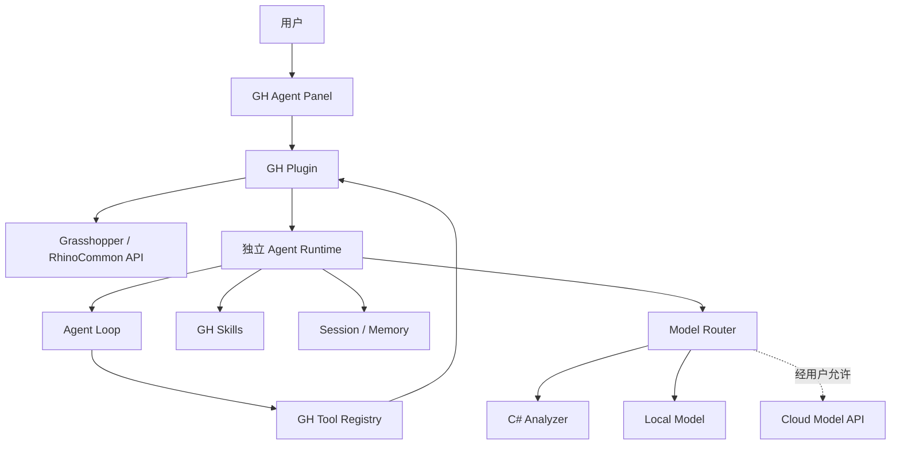

# GH Data Tree Agent 贯穿案例

## 一、用户真正需要的结果

用户希望找到异常 Branch、Null、Path 不一致、数据匹配问题和上游根因，并得到安全、可验证的修复建议。因此产品应从可验证任务出发，而不是从“接哪个模型”出发。

## 二、四个成熟度阶段

1. **确定性分析器**：GH Plugin 读取文档，C# 规则返回异常。
2. **一次模型调用**：把结构化摘要交给模型生成自然语言解释。
3. **单个 GH Agent**：Agent Loop 按需调用 GH Tools、验证根因。
4. **混合与多 Agent**：规则层、本地模型、云端模型和审查 Agent。

## 三、推荐整体架构



GH Plugin 负责 UI、Document、SDK 读取和获批修改。Agent Runtime 负责目标、Session、上下文、Tools、Loop、权限和模型路由。模型负责复杂判断和解释，不能替代真实 GH API 观察。

## 四、最小 GH Tool

只读：

- `inspect_gh_document()`
- `inspect_component(component_id)`
- `inspect_data_tree(component_id, output_index)`
- `trace_upstream(component_id, depth)`

结构化 Tree 摘要示例：

```json
{
  "branchCount": 3,
  "paths": ["{0;0}", "{0;1}", "{0;2}"],
  "itemCounts": [15, 12, 0],
  "emptyBranches": ["{0;2}"],
  "nullCounts": [0, 1, 0]
}
```

修改工具如 `apply_tree_operation` 应有严格 Schema、用户确认和撤销能力。

## 五、完整 Agent Loop

```text
用户：为什么这个组件输出少了一组数据？

Step 1 → inspect_gh_document
结果：53 个组件、3 个警告

Step 2 → inspect_data_tree
结果：{0;2} 为空，{0;1} 有 Null

Step 3 → trace_upstream
结果：上游两路列表长度不一致

Step 4 → inspect_component
结果：Longest List 匹配，上游过滤后保留空 Path

Step 5 → 输出现象、证据、根因、修复、风险与验证方法
```

用户批准后才调用有限修改工具。

## 六、为什么先做 C# Analyzer

Path、Branch、Item、Null、数据长度和 Tree Matching 都适合确定性代码。先统计再给模型小摘要，可减少 Token、提高稳定性、保护隐私并便于验证。

```text
原始 GH 数据 → C# 解析统计 → 小型结构化摘要 → 模型推理
```

## 七、本地模型集成

```text
Rhino.exe
└─ Grasshopper
   └─ DataTreeAgent.gha
       │ localhost
       ▼
AgentService.exe
├─ Agent Loop
├─ Tools / Skills
├─ Session
└─ Ollama / llama.cpp
    └─ Local Model
```

安装器应检查硬件、推荐量化模型、允许不下载本地模型、提供云端模式、说明隐私费用，并支持 Runtime 与模型单独更新。

## 八、产品模式

| 模式 | 处理链 | 适合 |
|---|---|---|
| Basic | C# Analyzer | 规则明确、免费快速 |
| Local | Analyzer + 本地模型 | 隐私、离线 |
| Cloud | Analyzer + 云端模型 | 复杂推理 |
| Hybrid | Analyzer → Local → Cloud | 综合体验 |
| Team | Hybrid + 多 Agent + 任务平台 | 复杂协作 |

## 九、用通用 Agent 创造专用 Agent

```text
开发阶段：Codex 等通用 Coding Agent → 帮你实现 → GH 专用 Agent
运行阶段：GH 专用 Agent → 为最终用户解决 Data Tree 问题
```

开发工具阶段会消耗其模型 Token；最终产品是否产生云端 Token，取决于本地模型或云端 API。

## 十、MVP 顺序

1. 定义可验证问题；
2. 设计 TreeSnapshot；
3. 完成只读 GH Tools；
4. 完成 C# Analyzer 与测试；
5. 做一次模型解释；
6. 实现 Agent Loop；
7. 加 Session 和权限；
8. 再考虑本地模型；
9. 最后考虑多 Agent；
10. 修改工具晚于可靠只读诊断。

## 十一、自测

- [ ] 我知道 Plugin、Runtime 和模型的职责。
- [ ] 我能解释为什么规则分析先于模型。
- [ ] 我会先设计只读 Tool。
- [ ] 我能描述完整 GH Agent Loop。
- [ ] 我知道通用 Agent 与 GH 专用 Agent 是两个层次。
