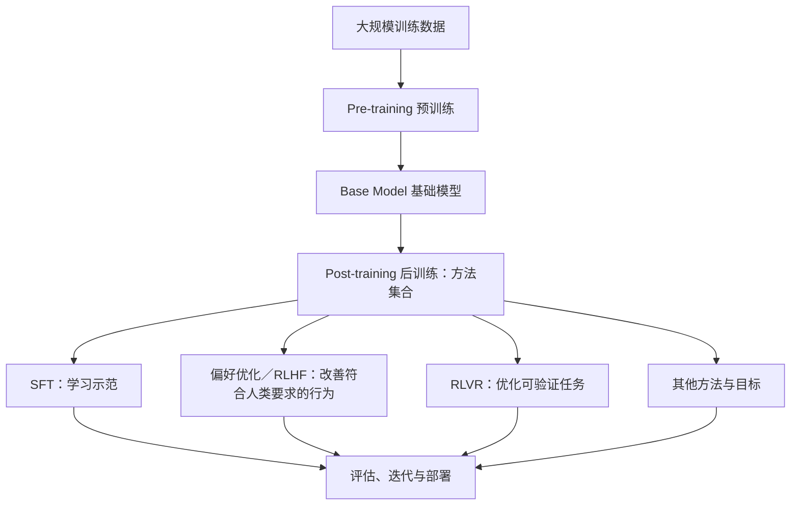

# 模型训练路线：预训练、SFT、RLHF、RLVR 与 RLCD

> [!summary] 一句话主线
> **预训练建立基础能力；后训练改善模型完成实际任务的方式；SFT 是后训练的一种方法，RLHF／RLVR 等也可在后训练中使用。**这不是所有模型都必须依次走完的固定流水线。

接续 [[01-AI系统全景图-模型-API-Agent]] 和 [[10-模型类型与多模型Agent]]。今天提问的原文见 [[原始对话-04-模型类型与训练]]。

## 一、先把“模型”和“训练方法”分开

| 缩写 | 英文 | 是什么 | 回答的问题 |
|---|---|---|---|
| LM | Language Model | 语言模型的大类 | 模型学什么语言规律？ |
| LLM | Large Language Model | 大规模语言模型 | 具备多大范围的语言能力？ |
| SFT | Supervised Fine-Tuning | 用高质量输入—输出示范微调 | 期望它怎样回答？ |
| RLHF | Reinforcement Learning from Human Feedback | 利用人类偏好信号优化 | 人更偏好哪种回答？ |
| RLVR | Reinforcement Learning with Verifiable Rewards | 利用可检查的奖励优化 | 结果能否通过验证？ |
| RLCD（Jev 语境） | Reinforcement Learning for Calibrated Decisions | TypeSafe 对其校准决策训练的命名 | 概率和真实正确率是否匹配？ |

**LM／LLM 是模型类别；SFT／RLHF／RLVR／RLCD 是训练方法或训练目标。**不要把这五个缩写画成同一层的五种模型。

> [!warning] RLCD 有同名缩写
> 在 Jev 发布材料中，RLCD 指 *Reinforcement Learning for Calibrated Decisions*。而 2023 年论文 [RLCD: Reinforcement Learning from Contrastive Distillation](https://arxiv.org/abs/2307.12950) 使用同样四个字母表示另一种方法。看见 RLCD，先核对上下文，不要默认它只指 Jev 的方法。

## 二、模型从基础到助手：正确的包含关系



> [!important] 对原对话图的修正
> 今天的对话最初把“预训练 → SFT → 后训练”画成顺序步骤，随后明确纠正：**SFT 通常属于后训练，不应与后训练并列为互不相干的阶段。**真实训练配方可组合或反复迭代，并不一定同时采用图中全部方法。[InstructGPT 论文](https://arxiv.org/abs/2203.02155)、[Tulu 3 论文](https://arxiv.org/abs/2411.15124)

### Pre-training（预训练）

用大规模文本、代码等数据学习广泛规律，得到 Base Model。它可能会续写和预测 Token，但不一定擅长按照用户指令提供有用、可靠的回答。

### Post-training（后训练）

在已有基础模型上进一步改善实际任务表现，是**阶段／方法集合**，不是一个单独算法。常见方法包括 SFT、偏好优化、RLHF、RLVR 等；具体配方因模型而异。

### SFT（监督微调）

用高质量“问题—理想回答”示范，让模型学会任务格式与指令行为。例如 GH 诊断示范：

```text
输入：某组件输出的 Tree 缺少一条分支
理想回答：定位 → 证据 → 可能根因 → 最小修复 → 验证步骤
```

如果只是固定回答结构，**先试 Prompt**；已有大量高质量案例并发现 Prompt 不足时，再考虑微调。

## 三、三种“好不好”的反馈信号

| 方法 | 主要信号 | GH 例子 | 常见局限 |
|---|---|---|---|
| RLHF | 人类偏好／奖励模型 | 专家更偏好有证据、谨慎的诊断 | “读起来好”不等于技术正确 |
| RLVR | 程序可验证的奖励 | 代码测试、组件运行、数据树结构检查 | 验证器和测试覆盖不足会误导训练 |
| RLCD（Jev 语境） | 决策概率的校准目标 | 标称 80% 的一组判断约 80% 正确 | 发布方尚未公开可独立复现的完整训练配方 |

RLHF 的经典实例从人类示范出发，再利用比较排序进行强化学习；RLVR 则常用于答案或程序结果能够自动检验的任务。[InstructGPT](https://arxiv.org/abs/2203.02155)、[Tulu 3](https://arxiv.org/abs/2411.15124)

TypeSafe 将其 Jev 方法称为 RLCD，并描述了“校准决策”的目标；这属于**厂商声明**。截至 2026-09-21，公开资料不足以独立确认具体训练算法或其普遍适用效果。[TypeSafe 发布说明](https://typesafe.ai/blog/introducing-system-one-models-and-jev)

### 什么叫“概率校准”

如果模型在很多次预测中都报“80% 把握”，其中约 80% 最终正确，才可说它在这组任务上大致校准。**单次 80% 不是正确性的保证**。要评估，还需看不同置信区间、不同类型问题、分布变化与失败代价。

## 四、训练方式与开发者日常操作不是一回事

| 你在做什么 | 是否改变模型权重？ | 更适合什么阶段？ |
|---|---|---|
| Prompt / 规则 | 否 | 最快验证任务与输出格式 |
| Tools / C# Analyzer | 否 | 获取真实 GH 数据与确定性检测 |
| RAG / Embedding 检索 | 通常否 | 让模型访问外部专业资料 |
| Fine-tuning / SFT | 是 | 积累足量高质量示范后 |
| LoRA | 是，通常训练小型适配参数 | 较低资源成本地微调 |
| 从零预训练 | 是，且资源需求极高 | 通常不是个人 GH 插件 MVP 的起点 |

**RAG 是检索并提供上下文，不等于训练模型；LoRA 是参数高效微调方法，不是新的基础模型类别。**

## 五、DataTreeDoctor 的实际学习与建设顺序

```text
1. C# Analyzer + GH SDK：先把问题看准
2. 一个现成 LLM + Prompt：验证解释与诊断价值
3. 专业知识库 + RAG：确有检索需求时加入
4. 收集“问题—诊断—修复—验证”案例：形成数据资产
5. 评测体系：检验准确率、错误代价、延迟与隐私
6. 必要时 SFT / LoRA：让模型学习稳定的 GH 专业行为
7. 只有在可验证环境和大量训练资源成熟时，再研究 RLVR
```

一条好案例不能只写“错误名称”，还应包括 GH 组件连接、输入输出 Tree、用户操作、真实原因、修复步骤与验证结果。**先拥有可靠数据和评测，再讨论训练“自己的 GH 大模型”。**

## 六、自测

- [ ] 我知道 LLM 是 LM 的一种，而 RLHF 不是模型类型。
- [ ] 我能正确画出 SFT 与 Post-training 的包含关系。
- [ ] 我能区分 RLHF 的人类偏好和 RLVR 的程序验证。
- [ ] 我知道 Jev 语境里的 RLCD 不等于 2023 年论文里的 RLCD。
- [ ] 我知道概率校准是大量预测的统计性质。
- [ ] 我能区分 Prompt、RAG、SFT 和 LoRA 是否改变权重。
- [ ] 我不会在 GH MVP 尚未验证价值时先从零训练模型。

## 一手资料

- [InstructGPT：人类示范、SFT 与 RLHF](https://arxiv.org/abs/2203.02155)
- [Tulu 3：包含 SFT、偏好优化和 RLVR 的开放后训练配方](https://arxiv.org/abs/2411.15124)
- [TypeSafe AI：Jev 与厂商命名的 RLCD](https://typesafe.ai/blog/introducing-system-one-models-and-jev)
- [RLCD 的另一种含义：Contrastive Distillation 论文](https://arxiv.org/abs/2307.12950)
