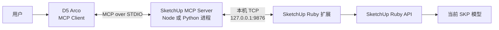

# MCP 原理与 SketchUp 接入：从协议到本地工具链

> [!summary] 一句话主线
> **MCP 的全称是 Model Context Protocol（模型上下文协议）。它不是模型，也不是某个 SketchUp 插件，而是一套让 AI 客户端发现并调用外部工具与上下文的通信标准。**

接续 [[01-AI系统全景图-模型-API-Agent]]、[[02-Agent内部结构与Agent-Loop]]。本次问答原文见 [[原始对话-05-SketchUp-MCP]]。

## 一、先建立正确位置：MCP 到底处于哪一层

可以把整个系统想成五个角色：

| 角色 | SketchUp 场景中的例子 | 主要职责 |
|---|---|---|
| AI 模型 | D5 Arco 背后调用的模型 | 理解意图、决定是否调用工具 |
| MCP Client（客户端） | D5 Arco | 连接 MCP Server、向模型展示工具、发送调用 |
| MCP Server（服务端） | Node 或 Python 运行的 SketchUp MCP 程序 | 按 MCP 标准暴露工具，并把调用转给 SketchUp |
| 应用内扩展 | 安装在 SketchUp 中的 `.rbz` Ruby 扩展 | 接收本地命令，调用 SketchUp Ruby API |
| 目标应用 | SketchUp 与当前 `.skp` 模型 | 真正创建、修改、查询和导出模型 |



最容易混淆的是：**D5 Arco 里“添加 MCP”只完成了客户端到 MCP Server 的连接；要真正操作 SketchUp，还必须安装并运行与该 Server 配套的 SketchUp 扩展。**

## 二、MCP 不是一个软件，而是一套共同语言

协议的作用类似“统一插座标准”：

```text
没有统一协议：每个 AI 客户端 × 每个外部软件都要单独适配

使用 MCP：
AI 客户端 ──统一的 MCP── MCP Server ──应用自己的接口── 外部软件
```

对初学者，先记住三个重点：

1. **MCP 不负责推理。**推理仍由模型完成。
2. **MCP 不等于 API。**MCP 可以在服务端内部继续调用 SketchUp API、网页 API、数据库等。
3. **MCP Server 必须真实运行。**配置文件只是告诉客户端“如何启动或连接它”。

OpenAI 的 Codex 文档把 MCP 定义为连接模型、工具与上下文的协议；Codex 支持本地 STDIO Server 和通过地址访问的 Streamable HTTP Server。[OpenAI MCP 文档](https://learn.chatgpt.com/docs/extend/mcp)

## 三、为什么这里同时出现 STDIO 和 TCP

它们位于不同的连接段，并不矛盾：

| 连接段 | 通信方式 | 解释 |
|---|---|---|
| D5 Arco ↔ MCP Server | STDIO | D5 Arco 启动子进程，通过标准输入/输出交换 MCP 消息 |
| MCP Server ↔ SketchUp 扩展 | 本机 TCP | 独立进程通过 `127.0.0.1:9876` 把命令转给 SketchUp |

因此，“类型选择 STDIO”不表示整个系统只用 STDIO，也不表示 SketchUp 自己实现了 MCP。中间的 MCP Server 实际上还是一个桥接器。

> [!tip] `127.0.0.1` 是什么
> 它表示“这台电脑自己”。默认只让本机程序访问，比直接暴露在局域网或互联网更安全。`9876` 是这里采用的端口号，可以理解为本机上指定程序的“门牌号”。

## 四、Node、npm、npx、Python、uv 和 uvx 的关系

这些工具不是 MCP 的组成部分，而是**启动不同语言编写的 MCP Server 所需的运行环境或包工具**。

| 名称 | 所属生态 | 核心作用 | 在本场景中的位置 |
|---|---|---|---|
| Node.js | JavaScript | 在电脑上运行 JavaScript 程序 | 运行 Node 版 MCP Server |
| npm | Node.js | 安装和管理 Node 软件包 | 安装 Server 包或依赖 |
| npx | Node.js | 查找并直接运行 Node 软件包 | 启动 `@parkhill/mcp-server-for-sketchup` |
| Python | Python | 运行 Python 程序 | 运行 Python 版 MCP Server |
| pip | Python | 安装 Python 软件包 | 传统 Python 包安装工具 |
| uv | Python | 管理 Python、依赖和虚拟环境等 | 为 Python MCP 提供快速环境管理 |
| uvx | uv | 在隔离环境中直接运行 Python 命令行工具 | 启动 `sketchup-mcp2` |

```text
Node 路线：D5 Arco → npx → Node 版 MCP Server
Python 路线：D5 Arco → uvx → Python 版 MCP Server
```

`npx` 与 `uvx` 的共同点是“减少手工安装步骤并直接运行工具”；但它们属于两套不同生态，不能机械地认为每个功能都一一对应。

## 五、两条 SketchUp MCP 路线

### 路线 A：Node.js 版本

对话中讨论的包是：

```text
@parkhill/mcp-server-for-sketchup
```

典型 STDIO 配置逻辑：

```text
启动命令：npx
参数 1：-y
参数 2：@parkhill/mcp-server-for-sketchup@latest
```

它要求 Node.js 20 或更高版本，并需要安装同一项目发布的 `su_mcp` SketchUp 扩展。MCP Server 通过 STDIO 对接客户端，再通过本机 TCP `127.0.0.1:9876` 对接扩展。[npm 包说明](https://www.npmjs.com/package/@parkhill/mcp-server-for-sketchup)

### 路线 B：Python／uv 版本

对话中讨论的包是：

```text
sketchup-mcp2
```

典型 STDIO 配置逻辑：

```text
启动命令：uvx
参数：sketchup-mcp2
```

它同样需要安装该项目配套的 `.rbz` 扩展，并默认连接本机 `127.0.0.1:9876`。当前 PyPI 包要求 Python 3.10 或更高版本。[sketchup-mcp2 项目](https://github.com/zinin/sketchup-mcp2)、[PyPI 说明](https://pypi.org/project/sketchup-mcp2/)

> [!warning] 不要混装两套项目
> Node Server 应配套 Node 项目的 `.rbz`，Python Server 应配套 Python 项目的 `.rbz`。虽然它们可能使用相同端口和相似工具名，但通信协议、功能和版本兼容范围可能不同。**“MCP 标准相同”不等于 Server 与应用内扩展可以任意混搭。**

## 六、从安装到调用的完整工作顺序

```text
1. 先选一条路线：Node+npx 或 Python+uvx
2. 安装并验证对应运行环境
3. 从同一项目下载并安装匹配的 SketchUp .rbz
4. 打开 SketchUp，确认扩展的本地 Server 已启动
5. 在 D5 Arco 中添加 STDIO MCP 配置
6. 保存并重启／重新连接客户端
7. 确认工具列表能够出现
8. 先做状态查询或读取测试，再做创建、删除、变换等写操作
```

这里要区分两个“启动”：

- D5 Arco 启动的是 **MCP Server 进程**。
- SketchUp 中启动的是 **Ruby 扩展的本地 TCP Server**。

缺少其中任何一侧，完整链路都无法工作。

## 七、如何判断问题发生在哪一层

| 现象 | 优先检查 |
|---|---|
| 提示找不到 `npx` | Node.js 是否安装；终端能否执行 `node -v`、`npm -v`、`npx -v` |
| 提示找不到 `uvx` | uv 是否安装；终端能否执行 `uv --version`、`uvx --version` |
| MCP 根本无法启动 | 启动命令、参数、网络下载、包名和运行环境 |
| 能看到工具，但提示 SketchUp 未运行 | SketchUp 是否打开；`.rbz` 是否安装并启用；本地 Server 是否启动 |
| 连接超时／Busy | SketchUp 是否弹出模态窗口、执行长任务或卡死；超时时间是否过短 |
| 版本不兼容 | MCP Server 包与 `.rbz` 是否来自同一项目、是否在兼容版本范围 |
| 端口连接失败 | `127.0.0.1:9876` 是否正在监听；是否被其他程序占用或被安全软件拦截 |
| 工具有但调用结果异常 | 单位、选择对象、当前场景状态及具体工具参数是否正确 |

排错时不要一次重装全部组件。按链路逐段确认：

```text
运行环境 → MCP Server → MCP 握手／工具列表 → TCP → SketchUp 扩展 → SketchUp API
```

## 八、安全边界：能操作建模软件，也意味着能造成修改

MCP Server 暴露的工具可能包含创建、删除、变换、导出，甚至执行任意 Ruby 代码。要注意：

- 只安装你信任并核对过来源的 MCP Server 与 `.rbz`。
- 保持 SketchUp 端口绑定在 `127.0.0.1`，没有明确需要时不要暴露到局域网或公网。
- 对删除、覆盖、批量修改等工具保留人工确认。
- 首次测试使用副本或空白模型，并保存可回退版本。
- 如果项目支持关闭 `eval_ruby`，不需要任意代码执行时应关闭或限制它。
- 不要因为工具由 AI 调用，就默认结果一定正确；重要模型仍需人工检查。

## 九、核心术语速查

| 术语 | 新手记法 |
|---|---|
| MCP | AI 与外部工具沟通的标准 |
| MCP Client | 使用这些工具的一方，例如 D5 Arco |
| MCP Server | 把具体能力包装成 MCP 工具的一方 |
| Tool | 模型可以选择调用的一项操作 |
| STDIO | 客户端与本地子进程通过标准输入/输出通信 |
| Streamable HTTP | 客户端通过网络地址访问 MCP Server |
| TCP | 两个运行中程序之间的一种网络通信方式 |
| localhost / 127.0.0.1 | 当前这台电脑自身 |
| 端口 | 区分本机不同网络服务的编号 |
| `.rbz` | SketchUp 扩展安装包 |
| Ruby API | SketchUp 扩展用来查询或修改模型的编程接口 |

## 十、常见误区

- **误区：MCP 是一种大模型。** 不是，MCP 是协议。
- **误区：安装 `.rbz` 就完成了。** 还需要 MCP 客户端和中间 Server。
- **误区：D5 Arco 显示 MCP 已添加，就代表 SketchUp 已连通。** 工具进程启动与 SketchUp 端连接是两件事。
- **误区：STDIO 与 TCP 只能选一个。** 它们可以服务于链路的不同区段。
- **误区：Node 和 uv 都必须安装。** 通常选择一条实现路线即可。
- **误区：所有 SketchUp MCP 都能共用同一个 `.rbz`。** 必须核对项目和版本兼容性。
- **误区：能调用工具就可以完全放手运行。** 写操作、任意代码执行和文件导出仍需要权限与人工审核。

## 十一、自测

- [ ] 我能说出 MCP 的英文全称和中文含义。
- [ ] 我知道 D5 Arco、MCP Server、`.rbz` 扩展和 SketchUp 分别是什么角色。
- [ ] 我能解释为什么同一条链路同时出现 STDIO 与 TCP。
- [ ] 我能区分 Node／npm／npx 和 Python／uv／uvx。
- [ ] 我知道选择 Node 或 Python 路线后，必须使用匹配的 SketchUp 扩展。
- [ ] 我会按链路逐段排错，而不是把所有问题都归因于“MCP 坏了”。
- [ ] 我知道 `eval_ruby`、删除和批量修改类工具需要额外谨慎。

## 一手资料

- [OpenAI：Model Context Protocol](https://learn.chatgpt.com/docs/extend/mcp)
- [Parkhill SketchUp MCP 的 npm 包说明](https://www.npmjs.com/package/@parkhill/mcp-server-for-sketchup)
- [sketchup-mcp2 GitHub 项目](https://github.com/zinin/sketchup-mcp2)
- [sketchup-mcp2 PyPI 页面](https://pypi.org/project/sketchup-mcp2/)

