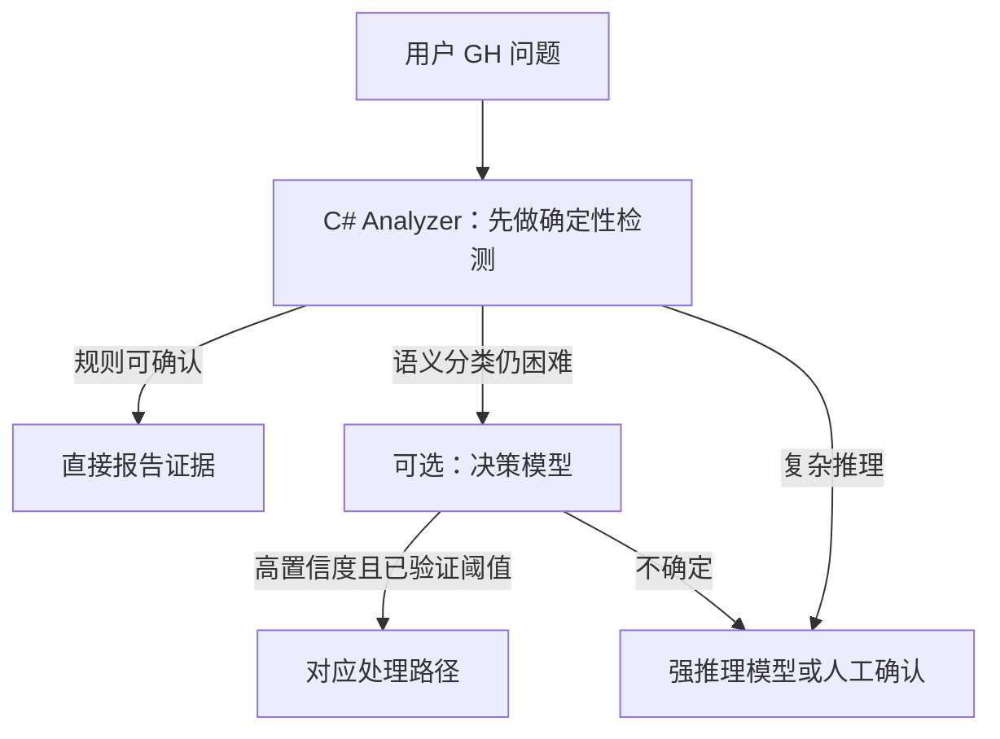
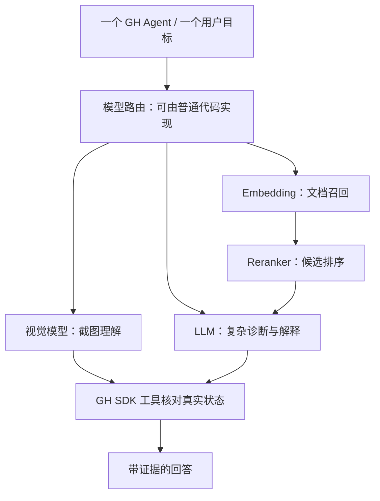

# 模型类型与多模型 Agent：按任务选能力

> [!summary] 先记住
> **模型没有公认的固定“总共多少种”。**“语言、多模态、Embedding、世界模型”偏向**任务与能力**；“Transformer、Diffusion、MoE”偏向**架构**；“本地／云端”偏向**部署位置**。这些维度会重叠，不能把它们加总成一个唯一数字。

这篇接续 [[01-AI系统全景图-模型-API-Agent]]、[[02-Agent内部结构与Agent-Loop]] 和 [[07-GH-Data-Tree-Agent贯穿案例]]。今天的原话另存于 [[2026-09-21-名词解释原始对话]]。

## 一、先用“分类轴”，不要死记类别数

| 分类轴 | 关心的问题 | 例子 |
|---|---|---|
| 任务／能力 | 模型擅长做什么？ | 语言生成、图像生成、检索、排序、语音、动作预测 |
| 输入输出模态 | 处理什么形式的信息？ | 文字、图像、音频、视频、结构化状态 |
| 模型架构 | 内部怎样计算？ | Transformer、Diffusion、MoE、状态空间模型 |
| 训练方式 | 怎样学到能力？ | 预训练、SFT、偏好优化、可验证奖励 |
| 部署位置 | 在哪里运行？ | 云端 API、本地设备 |
| 产品角色 | 在系统中负责哪一步？ | 主推理、检索、路由、校验、生成 |

> [!important] 交叉而非互斥
> 一个模型可以同时是“语言模型”“多模态模型”“使用 Transformer 和 MoE 的模型”“云端服务”。“推理模型”也常指某类语言模型的能力与产品定位，并不必然是与 LLM 并列的基础类别。

### 对 Agent 开发最实用的能力分工

| 能力 | 常见用途 | DataTreeDoctor 示例 |
|---|---|---|
| LLM／推理模型 | 理解问题、规划、解释、生成代码 | 分析复杂 Data Matching 根因 |
| 视觉／多模态模型 | 理解截图、图纸、视频 | 读取 GH Canvas 截图 |
| Embedding 模型 | 把资料变成向量以快速召回候选 | 从 GH 文档库找相关知识 |
| Reranker | 对候选资料重新排序 | 从 20 篇候选中挑最相关的 3 篇 |
| 分类／决策模型 | 在已定义候选项中选择或评分 | 将问题路由到规则、Debug Agent 或人工 |
| 语音模型 | 语音识别、合成、交互 | 语音描述 GH 故障 |
| 世界／动作模型 | 预测环境变化或动作 | 机器人／具身任务；并非 GH MVP 必需 |

Embedding 和 Reranker 往往配合使用：**前者广泛召回，后者精细排序**。但知识库还没成为瓶颈时，不必为了“架构完整”而先装上它们。

## 二、Jev：今天对话中的新例子

TypeSafe AI 在 2026 年 9 月 15 日将 Jev 发布为其首个 *System One Model*，定位为软件内的快速、类型化决策：预先定义输出选项，让模型返回选择／评分及概率，而非长篇自由文本。**“System One”是发布方的产品分类，不是所有 AI 模型必须采用的标准分类。**[TypeSafe 发布说明](https://typesafe.ai/blog/introducing-system-one-models-and-jev)

```text
输入：客户或任务的描述
预定义选项：Debug / Coding / Research
输出：某个选项 + 概率估计
```

发布方公布了延迟、价格和性能数据，但这些是特定测试条件与厂商声明，**不能直接推断 Jev 在所有任务上更快、更准或更省**。截至本笔记编写时，公开材料也不足以独立复现其 RLCD 训练方法。用它做产品路由前，应在自己的真实任务集上测量准确率、概率校准、延迟、成本与错误代价。[TypeSafe 产品说明](https://typesafe.ai/)

### 放进 GH Agent 时，顺序应是



**Empty Branch 是否存在**通常可由 C# 精确判断，不值得额外调用决策模型。Jev 一类模型更适合“规则难写、但又不需要完整长文本推理”的路由问题。

## 三、一个 Agent 可以用多个模型吗？

**可以。** 这叫 *Multi-Model Agent*；它不等于 *Multi-Agent System*。

| 设计 | 数量关系 | 核心问题 |
|---|---|---|
| 多模型 Agent | 1 个 Agent → 多种模型 | 同一任务中的不同智能步骤用哪个模型？ |
| 多 Agent 系统 | 多个 Agent → 可各用一个或多个模型 | 多个工作者怎样分工、协调与交接？ |



路由器**不一定也是模型**。简单、可明确判断的路由，优先用代码。

### 三种协作方式

1. **按需分工**：只调用本次任务真正需要的模型，通常是默认做法。
2. **接力**：视觉模型读截图 → LLM 提出假设 → GH SDK 验证 → LLM 解释。
3. **并行交叉检查**：两个模型独立分析后汇总；可能增加成本，也不保证更正确。

> [!warning] 多模型不等于每次“全员出场”
> 每多一次模型调用，就可能增加费用、延迟、数据传输和故障点。先证明单模型＋规则不足，再加专用模型。

## 四、API Key 与本地／云端

一个 Agent 同时用多个提供商时，通常要分别管理各提供商凭证；多模型聚合平台可能用一个平台 Key。本地模型通常不需要云端厂商 Key，但仍会消耗本机算力。具体 Key 可调用哪些模型由服务商授权范围决定，详见 [[03-本地模型-云端模型-API-Key与安全]]。

## 五、DataTreeDoctor 的渐进路线

1. **MVP：C# Analyzer**——先能准确读取 GH 状态、发现异常、给出可验证证据。
2. **V1：C#＋一个 LLM**——自然语言解释复杂问题，注意最小化传输的数据。
3. **V2：按需要加入 Embedding／RAG**——只有 GH 知识库检索确实有价值时再加。
4. **V3：Model Router＋本地／云端选择**——依据复杂度、隐私和成本路由。
5. **再评估决策模型与多模型并行**——由真实评测决定，不是架构装饰。

这与 [[06-多Agent任务拆分与Token优化]] 的原则一致：**先让确定性代码完成它最擅长的工作，再把剩余不确定性交给模型。**

## 六、自测

- [ ] 我能说出模型分类为什么没有固定总数。
- [ ] 我能区分“按能力分类”和“按架构分类”。
- [ ] 我知道多模型 Agent 不等于多 Agent 系统。
- [ ] 我知道 Model Router 可以只是普通代码。
- [ ] 我不会把 Jev 的厂商基准当作通用性能保证。
- [ ] 我能为 GH 故障设计“规则先行，按需调用模型”的路径。

## 资料与边界

- [TypeSafe AI：Introducing System One Models & Jev](https://typesafe.ai/blog/introducing-system-one-models-and-jev)——Jev 的发布方原始说明；其中性能和价格均为厂商数据。
- 原对话中的“11 类”是一套**教学用能力清单**，不是官方、互斥或穷尽的分类。
